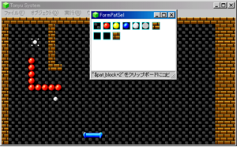
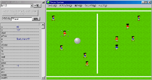
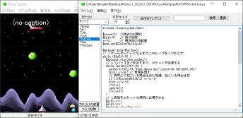
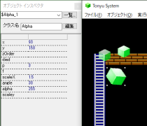

[Wikiトップ](./)

## Tonyu1とは
Tonyu Systemは，アクションゲームの作成に適したプログラミング言語環境です．　　

## 特徴

### 視覚的デザイン
キャラクタの配置やマップの作成はマウス操作で行います。ゲーム画面のレイアウトが素早く簡単にできます。  

  
↑ブロック崩しの面パターンなどは，マップエディタで作ることができます．  

  
↑オブジェクトをクリックすると各種パラメータが表示されます。  

  
↑オブジェクトをダブルクリックすると、コードエディタが開きます。  

### 並列処理
ゲームの動きをプログラムするのに便利な並列処理を完全にサポートします。キャラクタの動きはキャラクタ毎に独立して記述します。  
通常のゲームプログラムでは、「１フレーム（１コマ）毎に行う動作」を記述するのに対して「キャラクタが生まれてから、死ぬまでの動作」を自然に記述できます。

### グラフィックス・サウンドライブラリ
グラフィックスの表示やキー入力、サウンドなど、ゲームに必要な機能を簡単に使えます。  

  
↑回転表示や半透明表示もできます。  

### ネットランキング対応
CGIが実行可能なWebページをお持ちであれば、作成したゲームのハイスコア登録をWeb上で行えます。登録用CGIのPerlスクリプトが添付されています。

### チュートリアル
初心者のために、[簡単なゲームを作るための手順](./tutorial)をヘルプに添付しました。これを読みながらTonyuの使い方を学習することができます。

### サンプルプログラム
気軽に遊べるショートゲームを収録。ここで紹介した機能を一通り使っています。

## 動作環境

動作条件
- Windows 95以降（Windows専用）
- DirectX6以降

動作するOS  
- 別途インストール無し
  - Windows 11, 10, 8.1, 8, 7, Vista, XP, 2000, Me, 98SE
- DirectX6のインストールが必要
  - Windows 98, 95

最低動作環境  
- Windows98 / Pentium 266MHz / メモリ 128MB （[BBS No.8836](http://www.tonyu.jp/joyful/joyful.cgi?mode=res&no=8836)より）

***

[Wikiトップ](./)

