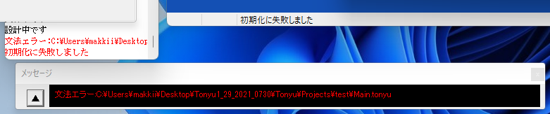

[Wikiトップ](./)

## エラーメッセージ

プログラムに書き間違えがあったり、実行中に異常な動作をした場合は、次のようなエラーウィンドウが表示されます。  



エラーメッセージをクリックすると、エラーが起きた場所にカーソルが移動するので、原因を調べてプログラムを訂正してください。  

### コンパイルエラー
コンパイルエラーは、ページを読み込んだ時や、実行させようとしたときに発生するエラーです。  

「文法エラー」
文法が正しくありません。例えば文の末尾にセミコロン(;)がないなどです。
「関数xxxは未定義です」  
呼び出そうとしている関数は定義されていません。関数の綴りが間違っていないか調べてみましょう。  

例1
```
//--ファイルClassA.tonyu--
extends Object;
function test(p) {
 print(p);
}
testo(p);  // 関数testoは未定義です
//--ClassA.tonyu終わり--
```
「循環参照があります」  
クラスの親子関係が不正です。例えば、 ClassAがClassBの親クラスで、かつClassBがClassAの親クラス であってはいけません。  

### 実行時エラー
実行時エラーは、プログラム実行中に発生するエラーです。  

### 「xxxはオブジェクトではないため、関数yyyを呼び出せません」
a.method1(); のように、他のオブジェクトのメソッドを呼び出そうと していますが、aの値がオブジェクトでない（数値やnull）ため メソッドを呼べません。  
aの値がおかしくなっていないか調べましょう。  
aの綴りが間違っている場合がよくあります。綴りが間違った変数はnullとみなされます。

例2
```
a=0;
a.run();  // 0はオブジェクトでないため、関数runを呼び出せません
```
「リストのインデックスが範囲を超えています(xx)」
Array型オブジェクトにおいてget,setメソッドなどをもちいたアクセスを行った場合に、要素を指定するための番号(添字)が範囲外です

例3
```
a=new Array();
a.add("apple");a.add("orange");
b=a.get(3);  // 配列aの要素は２つ（添字は0,1)なのに、添字の番号が3
```
### その他のエラー
「モジュールxxxxxのアドレスyyyyでzzzzへの読み込み（書き込み）違反がおきました」  
「参照カウントが負になりました」  
メソッドの呼び出しが無限に行われると発生する場合があります。  

例4
```
function test(x) {
  print (x);
  test(x+1); // 永久にtestが呼ばれる
} 
test(3);
```
それ以外の原因としては、Tonyuシステム自身のバグが考えられます。 その際は申し訳ありませんが、Tonyuを再起動してください。

***

[Wikiトップ](./)

