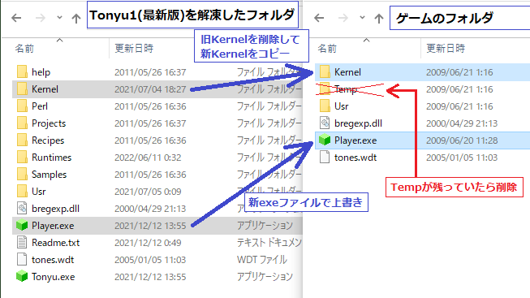

[ダウンロード](./download)&emsp;[Wikiトップ](./)

## ランタイムの更新方法

下記の場合、ランタイムを更新してください。

- [プロジェクトボード](https://www.tonyu.jp/project/top.cgi)などでダウンロードした古いTonyu System 1のゲームがWindows10や8.1で起動しない場合
- ランタイムのPlayer.exeを最新版に更新したい場合

### 更新手順

1. [最新版のTonyu1](./download)をダウンロードします
1. ダウンロードしたフォルダ内のKernelとPlayer.exeを、古い（起動しない）ゲーム側のフォルダに上書きします
- 注意点
  - Player.exeを上書きしただけだと、エラーが発生する可能性があります。Kernelも上書きしてください。
  - 古い（起動しない）ゲーム側のKernelは、余分なファイルが残らないように削除してからコピーしてください。
  - 古い（起動しない）ゲーム側にTempがある場合は削除してください。

- ステータスバーの表示が気になる場合はKernel/Cookies.iniの1行目(env.StatusBar)を0にすると消えます
  - Tonyu1_29_2021_0705以降は、Cookies.iniを書き換えなくても、ステータスバーが非表示になります

***

[ダウンロード](./download)&emsp;[Wikiトップ](./)

