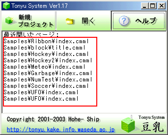
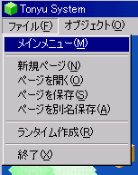

## まずはゲームをやってみる
Tonyuはアクションゲームを作ることができます。まずどんなゲームができるのか、サンプルゲームをやって確かめてみましょう。

起動画面の「最近使ったファイル：」のどれか１つをクリックしましょう

しばらくすると、ゲーム画面が開きます。ここで F9を押すとゲーム開始です。

- どのゲームも基本的に使用するのはマウスおよびカーソルキー、スペースキーのみです
- F3でポーズがかけられます。
- F2でゲーム終了です。リプレイは F9です

他のゲームをやるには、「ファイル」＞「メインメニュー」でメニューを表示させてください。

[Wiki トップ](./)

